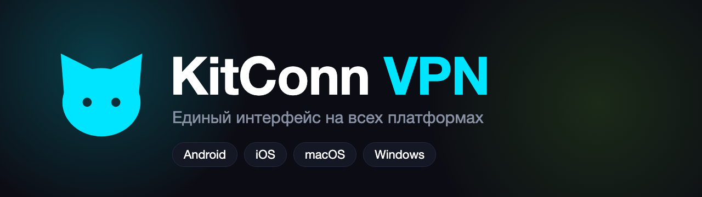
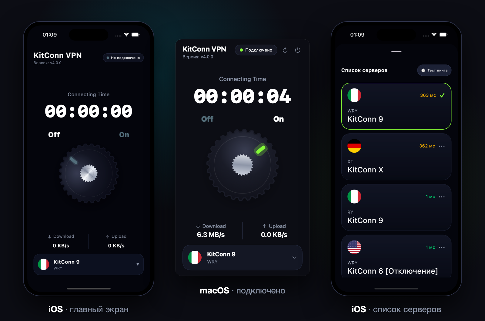

<p align="center">
  
</p>

<p align="center">
  
  
  
</p>

<p align="center">
  
  
  
  
</p>

## О проекте

**KitConn VPN** — клиент для подключения к серверам по протоколу VLESS (Xray-core). Интерфейс и вся логика написаны один раз
на Kotlin Multiplatform и Compose Multiplatform, поэтому приложение выглядит и работает одинаково на Android, iOS, macOS и Windows.

<p align="center">
  
</p>

## Возможности

- 🎛 **Ручка Off / On** с анимацией: нажимается и поворачивается
- ⏱ Таймер подключения, скорость загрузки и отдачи в реальном времени
- 🌍 Список серверов в виде стеклянных карточек, круглые флаги стран и замер пинга
- 💾 Выбранный сервер запоминается
- 🔗 Поддержка конфигураций VLESS: TCP, Reality, TLS, XHTTP
- 🐱 Минималистичный дизайн и сплэш с подмигивающим котом

## Платформы

| Платформа | Как работает VPN | Состояние |
|---|---|---|
| **Android** | `VpnService` + Xray, весь трафик устройства | собирается, уведомление с таймером; проверка на устройстве впереди |
| **macOS** | Xray + системный прокси, приложение в строке меню | работает |
| **Windows** | Xray + системный прокси (реестр), иконка в трее | собрано, ожидает проверки на Windows |
| **iOS** | управляет VLESS-клиентом через «Быстрые команды»; собственный туннель требует Network Extension | интерфейс работает, туннель — в разработке |

> На iOS собственный VPN-туннель возможен только с платной программой Apple Developer (Network Extension).
> Пока приложение передаёт сервер в установленный VLESS-клиент и включает его быстрой командой — см. [`iosApp/SHORTCUTS.md`](iosApp/SHORTCUTS.md).

## Скачать

Готовые сборки — в разделе [Releases](../../releases) (если релиз ещё не опубликован, собрать можно самостоятельно, см. ниже).

- **Windows** — портативный архив `KitConn-4.0.0-windows-portable.zip`: распаковать и запустить `KitConn.vbs`.
- **macOS** — образ `KitConn-4.0.0.dmg`: перетащить в «Программы», при первом запуске «Открыть» правой кнопкой.
- **Android** — пока собирается из исходников (`./gradlew :androidApp:assembleDebug`).

## Структура проекта

```
shared/       Kotlin Multiplatform: логика, ViewModel и весь интерфейс (Compose Multiplatform)
androidApp/   Android: VpnService + Xray, уведомление
iosApp/       iOS: SwiftUI-хост и Xcode-проект
desktopApp/   Windows и macOS (JVM): Xray + системный прокси, трей
```

Подробности по сборке, тестам и устройству каждого модуля — в [docs/DEVELOPMENT.md](docs/DEVELOPMENT.md).

## Быстрый старт для разработчика

```bash
./gradlew :shared:jvmTest              # тесты общей логики
./gradlew :androidApp:assembleDebug    # Android
./gradlew :desktopApp:run              # Windows / macOS
```

Токен API в репозиторий не коммитится: шаблон — `iosApp/Secrets.example.swift`, для Android и десктопа файл `Secrets.kt` создаётся локально.

## Благодарности

- [Xray-core](https://github.com/XTLS/Xray-core) — ядро для VLESS и Reality
- [Kotlin Multiplatform](https://kotlinlang.org/docs/multiplatform.html) и [Compose Multiplatform](https://www.jetbrains.com/compose-multiplatform/)
